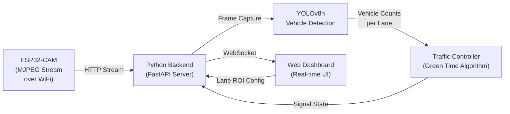
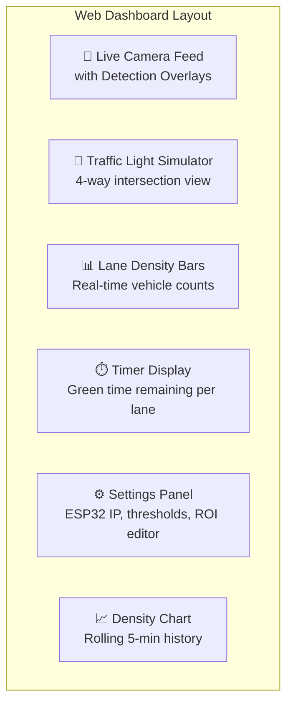
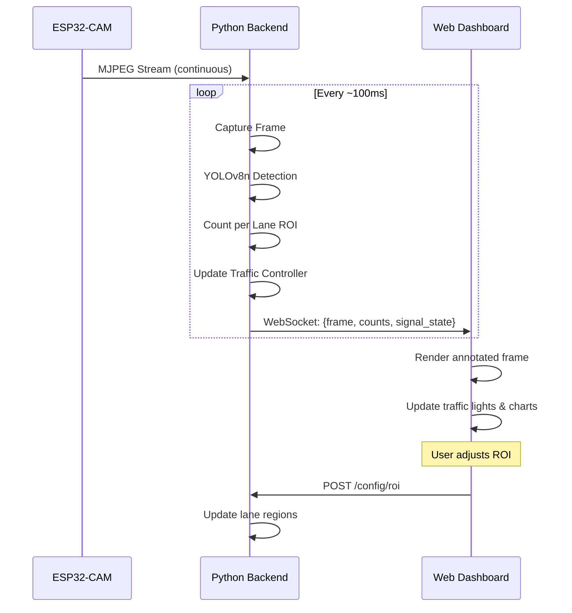

# Traffic Density Controller — Implementation Plan

## Problem Statement
Fixed-timer traffic lights cause unnecessary congestion. This system uses an **ESP32-CAM** module to stream live video, a **YOLOv8n** model running on a PC to detect and count vehicles per lane, and a **dynamic algorithm** to adjust green light durations proportionally. A **real-time web dashboard** provides live visualization.

---

## System Architecture



### Data Flow
1. **ESP32-CAM** → Streams MJPEG at `http://<ESP_IP>:81/stream`
2. **Backend** → Grabs frames from stream, runs YOLOv8n inference
3. **Detection** → Counts vehicles (car, truck, bus, motorcycle) in user-defined lane ROIs
4. **Controller** → Calculates proportional green time per lane based on density
5. **Dashboard** → Receives annotated frames + traffic state via WebSocket

---

## Phase 1: ESP32-CAM Firmware

### Hardware Wiring (USB-TTL → ESP32-CAM)

| USB-TTL Pin | ESP32-CAM Pin | Wire Color (typical) |
|:------------|:--------------|:---------------------|
| **5V**      | **5V**        | Red                  |
| **GND**     | **GND**       | Black                |
| **TX**      | **U0R** (RX)  | Green                |
| **RX**      | **U0T** (TX)  | White/Yellow         |
| **GND**     | **IO0**       | Jumper (for flashing only) |

> [!IMPORTANT]
> **IO0 → GND** jumper must be connected **only during upload**. Remove it after flashing and press RST to run the code.

### Firmware: `CameraWebServer` Sketch

We will use the built-in Arduino example with modifications:

#### [NEW] [esp32cam_firmware.ino](file:///c:/Users/rakhi/OneDrive/Documents/iot-tarffic/firmware/esp32cam_firmware.ino)
- Based on `File > Examples > ESP32 > Camera > CameraWebServer`
- Key configuration:
  - `#define CAMERA_MODEL_AI_THINKER` (uncommented)
  - WiFi SSID/password configured
  - Resolution set to **VGA (640×480)** — best balance of quality vs. frame rate
  - JPEG quality set to `12` (lower = better quality, 10-15 is ideal)
- Exposes endpoints:
  - `http://<IP>/` — Control page
  - `http://<IP>:81/stream` — MJPEG stream (consumed by Python backend)

### Arduino IDE Setup
1. Add ESP32 board URL: `https://raw.githubusercontent.com/espressif/arduino-esp32/gh-pages/package_esp32_index.json`
2. Install **ESP32** board package via Boards Manager
3. Select board: **AI Thinker ESP32-CAM**
4. Select COM port of USB-TTL adapter
5. Upload with IO0→GND jumper connected
6. Open Serial Monitor at **115200 baud** to get IP address

---

## Phase 2: Python Backend (Core Detection Engine)

### Model Choice: YOLOv8n (Nano)

> [!TIP]
> **Why YOLOv8n?**
> - **6.3M parameters** — lightweight, runs at **~30+ FPS on CPU**, **100+ FPS with GPU**
> - Pre-trained on COCO dataset — already knows: `car`, `truck`, `bus`, `motorcycle`, `bicycle`
> - Easy to use via `ultralytics` Python package
> - Can be exported to ONNX/TensorRT for further speedup if needed

**Alternative considered:** YOLOv5n — slightly older, YOLOv8n has better accuracy at same speed.

### Project Structure

```
iot-tarffic/
├── firmware/
│   └── esp32cam_firmware.ino        # ESP32-CAM Arduino sketch
├── backend/
│   ├── main.py                      # FastAPI server entry point
│   ├── detection/
│   │   ├── detector.py              # YOLOv8n inference wrapper
│   │   ├── tracker.py               # Simple centroid tracker (avoid double-counting)
│   │   └── lane_roi.py              # Lane ROI definitions & vehicle counting
│   ├── controller/
│   │   └── traffic_controller.py    # Green-light timing algorithm
│   ├── stream/
│   │   └── esp32_capture.py         # MJPEG stream frame grabber
│   ├── config.py                    # Configuration (ESP32 IP, model path, thresholds)
│   └── requirements.txt             # Python dependencies
├── dashboard/
│   ├── index.html                   # Main dashboard page
│   ├── style.css                    # Dashboard styling
│   └── app.js                       # WebSocket client & UI logic
└── README.md
```

### Key Backend Components

#### [NEW] [esp32_capture.py](file:///c:/Users/rakhi/OneDrive/Documents/iot-tarffic/backend/stream/esp32_capture.py)
- Connects to `http://<ESP32_IP>:81/stream`
- Parses MJPEG stream (finds JPEG SOI/EOI markers)
- Returns decoded frames as NumPy arrays
- Handles reconnection on stream failure
- Target: **10-15 FPS** capture rate (ESP32-CAM limitation at VGA)

#### [NEW] [detector.py](file:///c:/Users/rakhi/OneDrive/Documents/iot-tarffic/backend/detection/detector.py)
- Loads YOLOv8n model via `ultralytics` library
- Filters detections to vehicle classes only (COCO IDs: 2=car, 3=motorcycle, 5=bus, 7=truck)
- Configurable confidence threshold (default: `0.4`)
- Returns list of detections: `{class, confidence, bbox, center}`

#### [NEW] [lane_roi.py](file:///c:/Users/rakhi/OneDrive/Documents/iot-tarffic/backend/detection/lane_roi.py)
- Defines lane regions as polygonal ROIs (configurable via dashboard)
- Counts vehicles within each lane ROI using point-in-polygon test
- Supports 2-4 lanes (configurable for intersection simulation)

#### [NEW] [tracker.py](file:///c:/Users/rakhi/OneDrive/Documents/iot-tarffic/backend/detection/tracker.py)
- Simple centroid-based tracker to assign persistent IDs to vehicles
- Prevents double-counting of the same vehicle across frames
- Uses Euclidean distance matching between frames

#### [NEW] [traffic_controller.py](file:///c:/Users/rakhi/OneDrive/Documents/iot-tarffic/backend/controller/traffic_controller.py)

**Algorithm — Proportional Green Time Allocation:**

```
For each cycle:
  1. Count vehicles in each lane: V₁, V₂, V₃, V₄
  2. Total vehicles: V_total = V₁ + V₂ + V₃ + V₄
  3. Available green time: G_total = Cycle_Length - (num_phases × clearance_time)
  4. Green time for lane i:
     
     Gᵢ = max(G_min, min(G_max, (Vᵢ / V_total) × G_total))
  
  Where:
    - G_min = 10 seconds (minimum green, even for empty lanes)
    - G_max = 60 seconds (maximum green, cap for any lane)
    - clearance_time = 5 seconds (yellow + all-red per phase)
    - Cycle_Length = dynamically adjusted based on total density

  5. If V_total == 0: equal green time for all lanes
  6. Priority boost: Emergency vehicle detection → immediate green
```

**Density Classification:**

| Density Level | Vehicle Count (per lane) | Classification |
|:--------------|:-------------------------|:---------------|
| Empty         | 0                        | ⬜ No traffic   |
| Low           | 1–3                      | 🟢 Smooth      |
| Medium        | 4–7                      | 🟡 Moderate    |
| High          | 8–12                     | 🟠 Congested   |
| Critical      | 13+                      | 🔴 Heavy       |

#### [NEW] [main.py](file:///c:/Users/rakhi/OneDrive/Documents/iot-tarffic/backend/main.py)
- **FastAPI** application with:
  - `GET /` — Serves the dashboard (static files)
  - `WS /ws` — WebSocket endpoint streaming:
    - Annotated frame (base64 JPEG with bounding boxes drawn)
    - Vehicle counts per lane
    - Current traffic light state (which lane is green, time remaining)
    - Density classification per lane
  - `POST /config/roi` — Update lane ROI polygons
  - `POST /config/settings` — Update detection thresholds, ESP32 IP
  - `GET /api/stats` — Historical density data (last 5 minutes)
- Processing loop runs in a background thread:
  1. Capture frame from ESP32-CAM stream
  2. Run YOLOv8n detection
  3. Count vehicles per lane ROI
  4. Update traffic controller state
  5. Draw annotations on frame
  6. Push to all WebSocket clients

#### [NEW] [requirements.txt](file:///c:/Users/rakhi/OneDrive/Documents/iot-tarffic/backend/requirements.txt)
```
ultralytics>=8.0.0
fastapi>=0.100.0
uvicorn[standard]>=0.23.0
opencv-python>=4.8.0
numpy>=1.24.0
websockets>=11.0
python-multipart>=0.0.6
```

---

## Phase 3: Real-Time Web Dashboard

#### [NEW] [index.html](file:///c:/Users/rakhi/OneDrive/Documents/iot-tarffic/dashboard/index.html)
#### [NEW] [style.css](file:///c:/Users/rakhi/OneDrive/Documents/iot-tarffic/dashboard/style.css)
#### [NEW] [app.js](file:///c:/Users/rakhi/OneDrive/Documents/iot-tarffic/dashboard/app.js)

### Dashboard Features



**UI Design:**
- **Dark theme** with glassmorphism panels
- Left panel: Live video feed with bounding boxes and lane ROI overlays
- Right panel: 
  - Traffic light simulator (4-way intersection with animated signals)
  - Per-lane density bars (color-coded: green → yellow → red)
  - Countdown timer for current green phase
- Bottom panel: Rolling density chart (using Canvas or Chart.js)
- Settings modal: ESP32 IP config, confidence threshold slider, ROI polygon editor

**Tech:**
- Pure HTML/CSS/JS (no framework needed for this dashboard)
- WebSocket connection to FastAPI backend
- `<canvas>` for video frame rendering with overlays
- CSS animations for traffic light transitions

---

## Phase 4: Integration & Polish

### End-to-End Flow



---

## Open Questions

> [!IMPORTANT]
> **Q1: Number of lanes to simulate?**  
> Are you simulating a single road with 2 directions, or a full 4-way intersection? This affects the number of lane ROIs and the traffic light phase logic.

> [!IMPORTANT]
> **Q2: Physical traffic light control?**  
> Do you want the system to also control actual LEDs (connected to ESP32 GPIO pins) to simulate traffic lights physically? Or is the web dashboard simulation sufficient?

> [!NOTE]
> **Q3: Camera placement**  
> For best results, the ESP32-CAM should be mounted at an elevated angle (like a real traffic camera) looking down the road. Will you be testing with:
> - (a) The camera pointed at a real road/intersection?
> - (b) A printed/screen mockup of traffic for demo purposes?
> - (c) A pre-recorded video feed for testing?

> [!NOTE]
> **Q4: GPU availability**  
> Do you have an NVIDIA GPU? YOLOv8n runs fine on CPU (~15-25 FPS), but GPU acceleration via CUDA can push it to 100+ FPS. This affects whether we install `torch` with CUDA support.

---

## User Review Required

> [!WARNING]
> **WiFi Dependency:** The ESP32-CAM streams over WiFi. Both the ESP32-CAM and your computer must be on the **same WiFi network**. Streaming performance depends on WiFi signal strength. If you experience lag, consider lowering resolution to QVGA (320×240).

> [!IMPORTANT]
> **Model size:** YOLOv8n is ~6.3MB (nano variant). First run will auto-download the model weights. No manual download needed.

---

## Execution Timeline

| Phase | Task | Estimated Time |
|:------|:-----|:---------------|
| **1** | ESP32-CAM firmware flash & WiFi stream test | ~30 min |
| **2a** | Backend: Stream capture + YOLOv8n detection | ~1 hour |
| **2b** | Backend: Lane ROI + vehicle counting | ~45 min |
| **2c** | Backend: Traffic controller algorithm | ~30 min |
| **2d** | Backend: FastAPI + WebSocket server | ~45 min |
| **3** | Dashboard: UI + WebSocket client | ~1.5 hours |
| **4** | Integration testing & polish | ~1 hour |
| | **Total** | **~6 hours** |

---

## Verification Plan

### Automated Tests
- Run backend with a test video file (instead of ESP32-CAM stream) to validate detection pipeline
- Unit tests for traffic controller algorithm with mock vehicle counts
- WebSocket connection test from dashboard

### Manual Verification
1. Flash ESP32-CAM and confirm stream is accessible at `http://<IP>:81/stream`
2. Run backend and verify vehicle detections appear on dashboard
3. Test with varying "traffic" (moving toy cars, printed images, or real road if possible)
4. Verify green time adjusts proportionally — lane with more vehicles gets more green time
5. Record a demo video of the full system working end-to-end
